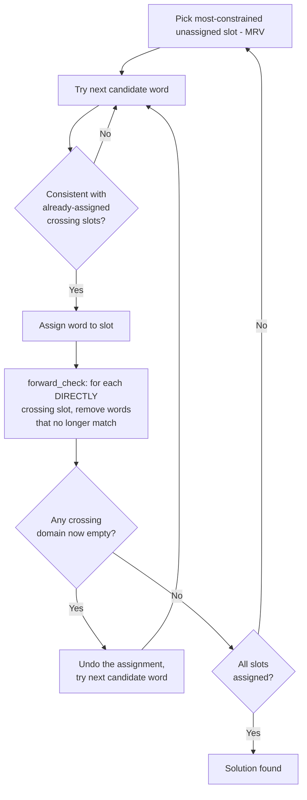
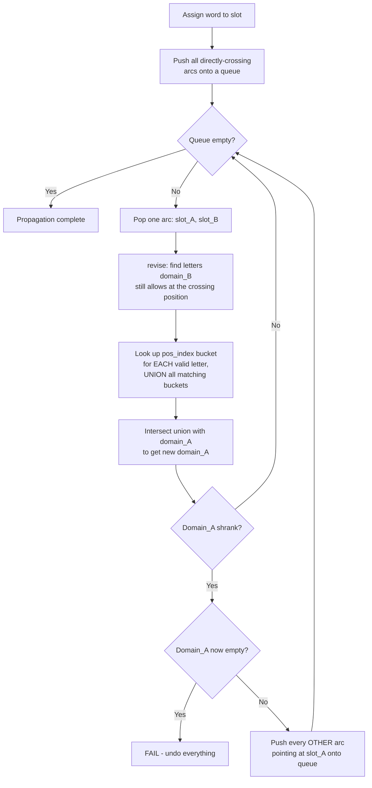
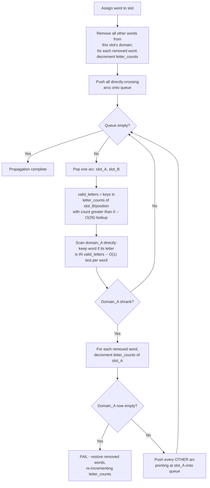
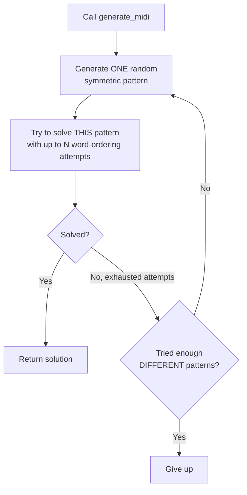
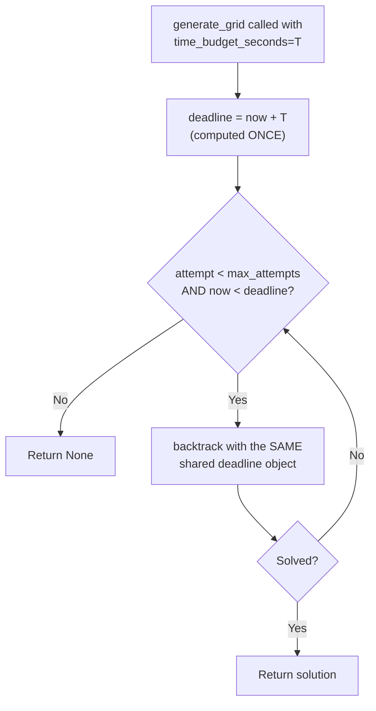
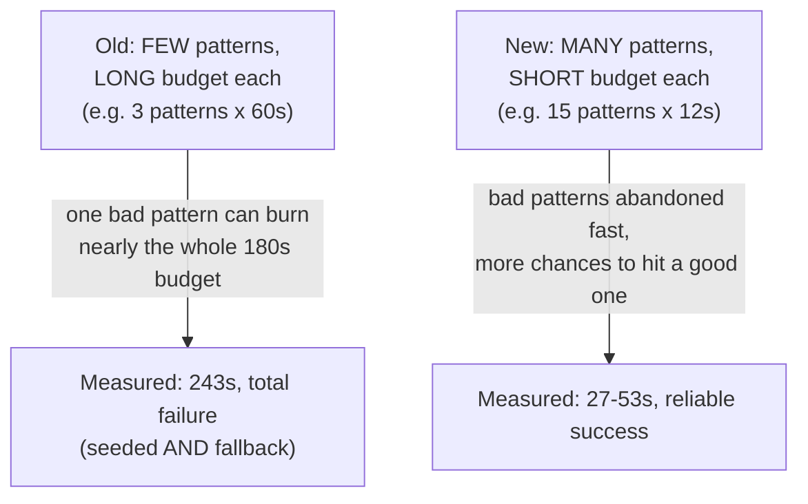

# Grid Generation Algorithms — Full Technical History
### Every version tried, in order, including the ones that failed and why

This document is a self-contained deep-dive into `grid_generator.py`'s core solving engine specifically — not the wider project. It exists so the algorithm's evolution can be studied on its own, with the reasoning, the failures, and the real measured numbers behind each step, rather than just the final code. Read alongside `project_log_week1.md` §5 (original 5x5 CSP setup) and `project_log_week1_part3.md` §1 (narrative summary of the Midi/Crossword work this document covers in full).

---

## 0. The problem, restated precisely

A crossword grid is a **Constraint Satisfaction Problem (CSP)**:
- **Variables**: each across/down "slot" (a maximal run of white cells in one direction).
- **Domains**: for each slot, all words of matching length from the word list.
- **Constraints**: for every pair of slots that cross (share a grid cell), the shared letter must agree.

American-style grids (this project's target) are **fully checked**: every white cell belongs to both an across slot and a down slot simultaneously. This is a stronger constraint density than something like Sudoku, and it's the reason grid-filling gets hard fast as grid size grows — full detail on this specific discovery is in Part 1 §5.4.

All algorithm versions below solve the same formal problem. What changes between versions is *how* they search for a solution and *how* they represent/maintain the state during that search.

---

## Version 1 — Backtracking + single-level forward-checking (original, 5x5-era)

### How it worked

Domains were plain Python **lists**. On each assignment, `forward_check()` looked only at the *direct* neighbors of the just-assigned slot — it did not propagate further. This is the classic textbook "backtracking + forward checking" algorithm, one level of consistency enforcement, no cascading.

### Where this worked fine
5x5 Mini grids: 8-22 slots, domains of at most a few thousand words. All 8 hand-picked Mini patterns solved in under a second each, reliably, across many repeated runs.

### Where this failed
Tried directly on a 9x9 Midi pattern (12 black squares, ~15% density) using the same ~23,000-word general dictionary that worked fine for Mini. **Did not complete within 60 seconds.** This was the first sign something fundamentally different was needed, not just "give it more time" — later testing (see "What Actually Fixed It" below) confirmed even multiple minutes wasn't enough for this combination of settings.

### Why, in CSP terms
Single-level forward-checking only catches *immediate* contradictions. A bad assignment can create a contradiction *two or three slots away* that forward-checking can't see, so the search wastes huge amounts of time exploring branches that were already doomed several steps earlier, only discovering the failure very deep in the recursion. This gets combinatorially worse as grid size (and therefore the crossing-dependency chain length between slots) grows. This is a well-known limitation of forward-checking as a technique — it's genuinely weaker than full arc consistency, not just "the same idea done less carefully."

---

## Version 2 — Full AC-3 with a position-index for candidate lookup (attempted, REJECTED)

### The idea
Replace single-level forward-checking with full **AC-3 (Arc Consistency Algorithm #3)**: whenever any slot's domain shrinks, re-examine every *other* arc pointing at that slot too, cascading until nothing changes anywhere or some domain empties out. This is strictly more powerful than single-level forward-checking — it catches contradictions forward-checking misses.

To make each individual consistency check ("which words in domain A are still supported by domain B") fast, this version added a **position index**: `pos_index[length][position][letter] -> set of words with that letter at that position`, built once from the full word list.

### What actually happened when tested
Measured directly (not assumed): a **single top-level assignment** in a fresh 9x9 grid took **0.18-0.29 seconds** and touched **~27,000-37,000 word removals**. Full search using this approach still did not complete in reasonable time.

### Why this was rejected — the actual finding
Profiling (`cProfile`) showed `revise()` itself was the dominant cost. The position-index approach unions the pos_index buckets for every currently-valid letter, and **those buckets represent the full, unpruned set of words with that letter at that position** — they don't shrink as the search progresses and domains get pruned. So even late in a search, when `domains[slot_a]` might only have a handful of words left, `revise()` was still doing work proportional to the *original, unpruned* bucket sizes. A direct isolated comparison (see Version 3) showed the "obvious optimization" was actually **counterproductive**: an index that doesn't shrink alongside the thing it's meant to help filter can lose to a plain scan of the (already-shrunk) thing itself.

**Lesson, stated plainly: an index built to speed up a lookup is only a win if the index's own size tracks the size of what you're actually searching. If the index stays at full size while the real data shrinks, the index can end up doing more work than not having one.**

---

## Version 3 — Full AC-3, plain domain scan with incrementally-maintained letter counts (ADOPTED)

### The idea
Drop the position index. Keep full AC-3 propagation (still necessary -- see Version 1's failure). For `revise()`, directly answer "which letters does domain B currently allow at this position" using an incrementally-maintained structure, `letter_counts[slot_id][position] = Counter({letter: count})`, updated by +1/-1 every time a word is added to or removed from a domain (rather than recomputed by scanning the whole domain each time). Then filter domain A by a plain scan with an O(1) set-membership check per word -- no index, no bucket-union, just "is this word's letter one of the (small, at most 26-entry) valid set."

### Verification this was actually faster (isolated benchmark, before trusting it in the full search)
A direct comparison, same test case as Version 2's failure: unioning pos_index buckets for a batch of 6 arc-checks took long enough to be the dominant cost in a 0.18-0.29s single assignment. The plain-scan-with-letter-counts approach did the **same 6 checks in 0.00074 seconds** -- roughly **130x faster** for that batch. This is the empirical justification for abandoning the position index entirely rather than trying to patch it further.

### Was this alone enough? No -- a second bottleneck appeared
Even after adopting this approach, full-search profiling (60 search nodes, real 9x9 pattern) showed:
- `revise()`: 2.4 seconds across 41,879 calls
- `_remove_from_domain` + `_add_to_domain` (letter_counts maintenance): approximately 1.9 seconds combined across roughly 1.93 million individual word add/remove operations

**966,571 individual word-level operations for just 60 search nodes** -- about 16,000 word operations per node on average. This is legitimate work (most attempted branches in backtracking search fail and get undone, so words get removed and then restored again almost as often as they're removed), not a bug -- but it meant the volume of work per node was still large, because initial domains were still in the thousands of words each.

### A real bug found and fixed along the way: node-budget accounting
A safety mechanism (cap how much search one attempt does before giving up and retrying with a fresh random ordering -- a standard, pragmatic CSP technique, since AC-3 guarantees local consistency but not that a bad ordering won't still wander into a huge unproductive subtree) was implemented, but the budget only decremented once per **recursive call**, not once per **candidate word actually tried**. Since the search tries many candidate words inside one call before recursing or giving up, this let a single "node" secretly do unbounded work. Measured concretely: a nominal 200-node budget took **3.7 seconds to process what the buggy accounting called "1 node."** Fixed by decrementing the budget on every word attempt, not every function call.

---

## What Actually Fixed It (not algorithm changes -- problem-instance changes)

With Version 3's algorithm core in place and the budget bug fixed, Midi/Crossword generation was correct but still often too slow in practice. Two changes, neither of them algorithmic, were the real unlock -- found by direct experimentation, not derived from theory:

### Black-square density
| Grid | Density | Result |
|---|---|---|
| 9x9 | 15% (12 black squares) | Did not complete in 60s |
| 9x9 | 20% (18 black squares) | 0.3s |
| 9x9 | 22% | 0.3s |
| 15x15 | 16% (36 black squares) | Did not complete in 45s |
| 15x15 | 20% (46 black squares) | Solved, but slow/variable (see below) |

Higher density -> more black squares -> shorter average word length -> each slot is less tightly constrained by its crossings -> dramatically easier CSP instance. This is *why* real newspaper crosswords run at their typical densities (NYT dailies: roughly 16-20%) -- it isn't an arbitrary aesthetic choice, it's close to a practical solvability floor, especially with generic (non-curated) vocabulary.

### Word list quality
The general dictionary (`word_bank.txt`, frequency + hallucination-risk filtered per Part 2, about 23k words) is a *valid-word* list, not an *interlocking-friendly* list -- it wasn't built with any awareness of which words tend to share letter patterns with other good crossword words. Downloaded a real, freely-shared, **crossword-community-scored** word list (`christophsjones/crossword-wordlist`, GitHub, about 170k entries scored 1-50 for crossword quality, built from real published crosswords' vocabulary). Filtered to score >= 40 (about 45k words) and re-ran the same 9x9/20%-density case:

| Word list | 9x9 at 20% density |
|---|---|
| General dictionary (`word_bank.txt`) | Did not complete in 60s |
| Curated crossword-quality list (score>=40) | 0.3s |

And for 15x15 at 20% density with the curated list: solved in **41.9 seconds**, with genuinely good fill quality (`ARTUROTOSCANINI`, `NEHRU`, `CHINESECHECKERS`, `COUNTERPART` all appeared in one real successful run).

**This is the single most important lesson of the whole Midi/Crossword investigation: past a certain point, the bottleneck was not the search algorithm at all -- it was that the input word list didn't have the properties the problem actually needed (letter-pattern diversity/interlock-friendliness), and no amount of algorithmic cleverness compensates for a poorly-suited input.**

---

## Version 3.1 -- Multi-pattern retry (robustness fix on top of Version 3)

### The remaining flakiness
Even with density + curated word list, `generate_midi()`/`generate_crossword()` were observed to occasionally hang or take much longer than typical (one real trial: 60+ seconds with zero completions across two attempts, vs. typical 1-10 second solves). Root cause: each call generated **one** random black-square pattern and only retried different word-orderings within that single pattern if the first attempt failed.

### The fix

Some specific patterns, despite passing identical structural validity checks (no 1/2-letter runs, fully connected) as every other pattern, are genuinely harder CSP instances than others -- this is expected and unavoidable in general, not a sign anything is broken. The fix tries up to 5 (Midi) / 3 (Crossword) different random patterns before giving up, rather than exhausting effort on a single possibly-unlucky one.

### Verification
Before fix: observed flaky behavior (some trials fast, one trial effectively hung).
After fix, 6 consecutive Midi trials: **all 6 succeeded, all under 5 seconds** (0.9s-4.5s range).
After fix, 5 Crossword trials: 4 completed under 10 seconds; 1 outlier took substantially longer. Improved, not fully eliminated -- worth knowing this tail risk exists rather than assuming the fix makes timing fully predictable.

---

## Version 4 — Wall-clock deadlines + a budget-allocation rewrite (current)

### The problem Version 3.1 didn't solve
Version 3.1's node-budget mechanism (cap search effort per attempt, retry with a fresh ordering) bounds *how much search happens*, not *how much wall-clock time it takes* -- those are only proportional if per-node cost is roughly constant. It isn't: a seeded topical word can make individual nodes far more expensive than an unseeded one (more constraint propagation per assignment, more restarts when a seed turns out to conflict). In practice this meant Crossword generation could still run for several minutes with no way to know whether it was making progress or effectively stuck -- "seems frozen" was a real, reported user complaint, not a hypothetical one.

### First fix attempt: add a wall-clock deadline, threaded through the retry loops
Added `time_budget_seconds` to `generate_grid()`, checked alongside the existing node-budget decrement inside `backtrack()` (cheap -- no extra overhead beyond a `time.monotonic()` call already happening at a similar cadence). `generate_midi()`/`generate_crossword()` were rewritten to compute an overall deadline and a no-seeding fallback phase (if every seeded attempt fails within budget, try again with `max_seeds=0` -- a strictly easier CSP instance, since forced topical words are what compounds difficulty the most -- before giving up entirely).

### A real bug in the fix itself, found by direct testing before shipping
Testing the new deadline mechanism directly (not assuming it worked because the code looked right) surfaced a second real bug: `generate_grid()`'s own internal retry loop (`max_attempts`, default 15) was recomputing a **fresh** deadline on every internal attempt, rather than sharing one deadline across the whole call. Concretely: a "15 second" `time_budget_seconds` could silently mean up to `15 x 15 = 225` seconds of real elapsed time, because each of the 15 internal retries got its own full fresh 15-second allowance -- this is exactly what caused Crossword generation to hang far longer than intended even *after* what looked like a working time budget had been added. **Fix:** compute the deadline once, outside the retry loop, and pass the same deadline object into every internal attempt.

### Second bug, found only after the first was fixed: per-pattern budget allocation was backwards
With the deadline bug fixed, `generate_crossword()` was still measured taking the full 243-second budget and failing completely -- both the seeded attempts *and* the supposedly-easier no-seed fallback. Investigation (comparing against known-good timings: solvable patterns finish in 1-5 seconds) found the actual problem was budget *allocation*, not a remaining correctness bug: giving only 3 pattern attempts a long budget each (180s / 3 = 60s per pattern) meant a single unlucky/hard pattern draw could consume almost the entire overall budget grinding on one bad instance, instead of the budget being spent trying many *different* patterns quickly.

**Fix:** inverted the allocation strategy -- short budget per pattern, many more patterns tried (`per_pattern_time_budget=12`, `pattern_attempts=15` for Crossword, within the same overall 180s ceiling). This matches the actual observed distribution directly: solvable patterns finish almost immediately, so a pattern that hasn't solved within ~12 seconds is more likely a bad draw than a slow-but-eventually-successful one, and should be abandoned in favor of a fresh pattern rather than persisted with.

### Third finding: max_seeds was the real lever, not the time-allocation math
Even with both bugs fixed, testing against the user's actual real daily priority-word set (not synthetic test data) showed `max_seeds=3` for Crossword took **155 seconds** to solve. Dropping to `max_seeds=2` solved the **same real word set in 27 seconds** -- each additional forced topical seed compounds the grid's constraints (it prunes options from everything it crosses, which prunes further options from whatever *those* cross), so difficulty scales much faster than linearly with seed count. Crossword's default was lowered from 3 to 2 guaranteed topical words per puzzle, judged a better tradeoff than a real risk of multi-minute generation for one extra guaranteed word. Midi's default (`max_seeds=3`) was left unchanged -- it has a larger grid and shorter typical solve times, so the same pressure wasn't observed there.

### Verified before shipping
Final confidence check, run 3 times fresh with real priority words: Crossword consistently completed in **32-53 seconds**. Midi confirmed still fast (0.4-9s) with the new allocation strategy applied for consistency. Nothing hangs indefinitely anymore -- the deadline mechanism guarantees a bounded return either way, and the no-seed fallback means a genuinely hard day's topical words degrade to "fewer guaranteed topical answers" rather than "no puzzle at all."

---

## Summary Table -- Every Version

| # | Approach | Consistency level | Candidate lookup | 9x9 result | Verdict |
|---|---|---|---|---|---|
| 1 | Backtracking + forward-check | Single-level (direct neighbors only) | Linear list scan | Did not complete (60s+) | Fine for 5x5, insufficient beyond |
| 2 | Full AC-3 + position index | Full (cascading) | Index bucket-union | 0.18-0.29s per single top-level assignment, still impractically slow overall | Rejected -- index didn't shrink with the data, net slower than no index |
| 3 | Full AC-3 + incremental letter counts | Full (cascading) | Plain scan, O(1) letter test | 130x faster than v2 in isolation; correct but still slow at default density/word list | Adopted as the core algorithm |
| -- | (fix) Node-budget accounting bug | -- | -- | Budget wasn't bounding real work | Bug, fixed |
| -- | (non-algorithmic) Density tuning | -- | -- | 15%: fails. 20%: 0.3s | The actual unlock, part 1 |
| -- | (non-algorithmic) Curated word list | -- | -- | General dict: fails. Curated: 0.3s | The actual unlock, part 2 |
| 3.1 | + multi-pattern retry | Full (cascading) | Plain scan, O(1) | 6/6 success, under 5s each (Midi) | Shipped, still had unbounded wall-clock risk |
| 4 | + wall-clock deadline (shared, not per-attempt) | Full (cascading) | Plain scan, O(1) | -- | Fixed a real bug: fresh-per-attempt deadline could 15x the intended budget |
| 4 | + inverted budget allocation (many-short vs. few-long patterns) | Full (cascading) | Plain scan, O(1) | 243s total failure (few-long) -> 27-53s reliable (many-short) | Adopted |
| 4 | + Crossword max_seeds 3 -> 2 | Full (cascading) | Plain scan, O(1) | Real data: 155s (seeds=3) -> 27s (seeds=2) | Adopted; current shipped default |

---

## Reusable Lessons From This Investigation

1. **A weaker consistency algorithm (single-level forward-checking) can work fine at small scale and fail completely at larger scale, even though nothing about the algorithm is "wrong" -- it's just not powerful enough for the dependency-chain lengths that show up as the problem grows.** This is why Version 1 needed to become Version 3, not just be given a bigger time budget.
2. **Test optimizations in isolation before trusting them in a full system, and be willing to reject one that seemed obviously correct in design.** The position index (Version 2) was a completely reasonable thing to try and looked like a textbook-standard speedup; it was only shown to be counterproductive by actually profiling it.
3. **Profile to find the real bottleneck rather than optimizing what seems likely to be slow.** The letter_counts maintenance cost (Version 3's own remaining bottleneck) was only found by profiling a real bounded search, not by inspection.
4. **When an algorithm is correct but still too slow, check whether the problem instance itself is unnecessarily hard before doing more algorithm work.** Density and word-list quality -- not the solver -- were what actually made Midi/Crossword practical. This is easy to miss if "the algorithm must be the bottleneck" is assumed by default.
5. **A "some retries get stuck, fresh restarts often don't" pattern shows up at multiple levels of the same system and is worth watching for at each one.** It appeared inside the solver (word-ordering restarts, addressed by the node-budget mechanism), one level up (pattern-choice restarts, addressed by multi-pattern retry), and again in Version 4's fix (many-short vs. few-long pattern budgets is the same insight applied to *how a fixed total budget gets divided up* across those restarts) -- recognizing it as the same underlying phenomenon made each successive fix faster to identify.
6. **A safety mechanism can be correct in isolation and still fail in composition.** Version 4's wall-clock deadline was correctly implemented at the `backtrack()` level from the start -- the bug was one level up, in how `generate_grid()`'s own retry loop recomputed it. Fixing and testing a mechanism at the level it's implemented doesn't guarantee it behaves correctly at the level it's *composed* into; both need direct verification.
7. **A parameter tuned against synthetic/test data (max_seeds, pattern-attempt budgets) should be re-validated against the real data it will actually run on before trusting the tuned value.** The 155s-vs-27s max_seeds finding only appeared when testing against the user's actual daily priority-word set, not the trivia-heavy synthetic set used during earlier development -- real topical words (fresher, more varied, less pre-filtered for interlock-friendliness) turned out to be a meaningfully harder test case than what the algorithm had been tuned against.
